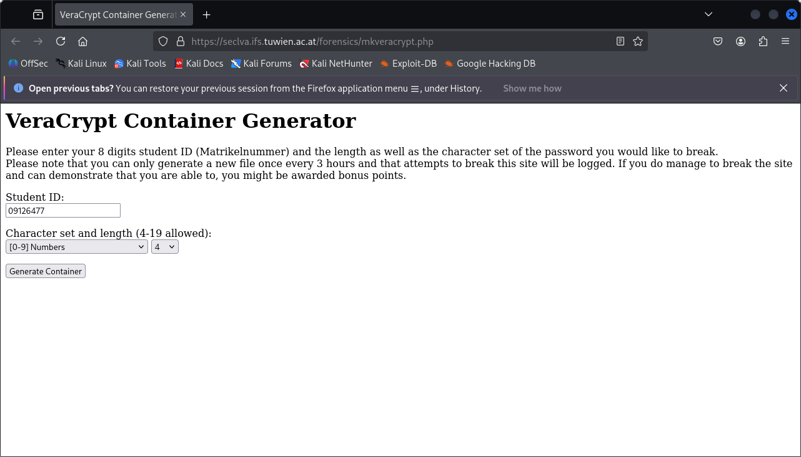
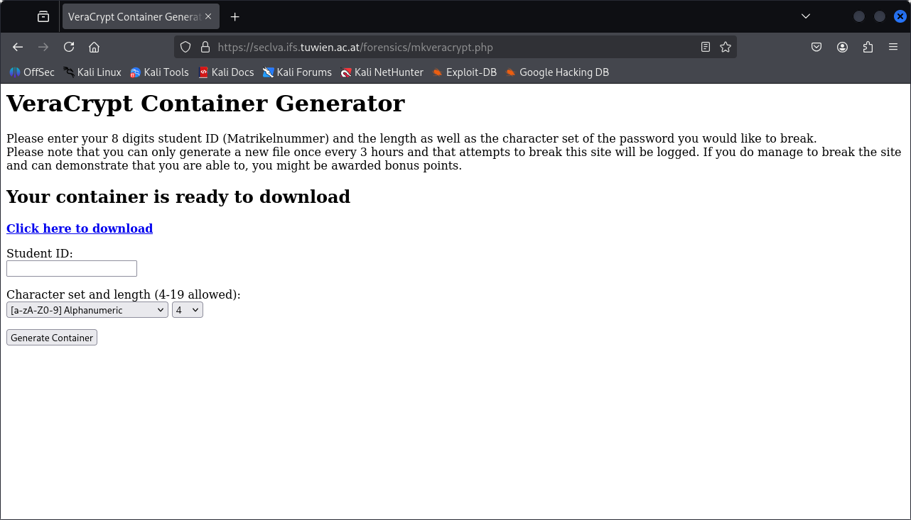

# Assignment 1
Date: 2025-09-30  
Student: Ernst Schwaiger

## Task Description

The client, Spongebob Squarepants, lost the password for his VeraCrypt container, which is a four-digit decimal number, he recalls using SHA-256 with an AES/XTS 512 bit symmetric key in legacy mode as encryption settings. The task the client gave is to recover the password.

## Analysis Environment

For the subsequent analysis steps, a Kali VM was installed in VirtualBox, Version 7.1.6 r167084 (Qt6.5.3), running on a Windows 11 host operating system. The underlying hardware hosts an AMD Ryzen 7 PRO 4750 CPU, clocked at 1.7GHz, and 32GB of RAM.
In VirtualBox, half of the 12 total (hyper threading) processor cores are assigned to the Kali virtual machine.

The following Kali image is used:
[https://cdimage.kali.org/kali-2025.3/kali-linux-2025.3-virtualbox-amd64.7z](https://cdimage.kali.org/kali-2025.3/kali-linux-2025.3-virtualbox-amd64.7z)  
SHA-256: a033797e690307f06d1e6daed4251339ff3aa62b970fb4c91036eba784fe91bc

```zsh
uname -a
Linux kali 6.12.38+kali-amd64 #1 SMP PREEMPT_DYNAMIC Kali 6.12.38-1kali1 (2025-08-12) x86_64 GNU/Linux
```

In the VM, the pre-installed hashcat version was used for cracking the password:
```zsh
hashcat --version                                                          
v6.2.6
```

For opening the container, a Linux VeraCrypt binary was downloaded from [https://veracrypt.io/en/Downloads.html](https://veracrypt.io/en/Downloads.html), the download link is:
[https://launchpad.net/veracrypt/trunk/1.26.24/+download/VeraCrypt-1.26.24-x86_64.AppImage](https://launchpad.net/veracrypt/trunk/1.26.24/+download/VeraCrypt-1.26.24-x86_64.AppImage)  
SHA-256: 5929b11be36fb528a2bebc9c6995f4a5f8fe467165ece0c1d76b7419903fc493

For extracting EXIF information from one of the files in the container, the built-in `exiftool` was used.
```zsh
exiftool -ver  
13.25
```

## Analysis

### Download Artifact

The VeraCrypt container was configured and downloaded from [https://seclva.ifs.tuwien.ac.at/forensics/mkveracrypt.php](https://seclva.ifs.tuwien.ac.at/forensics/mkveracrypt.php) using the student ID "09126477"

Configuration of container:


Download of container:



At first, the SHA-256 hash was taken from the downloaded artifact, "container_09126477.hc".
`sha256sum container_09126477.hc` yields a value of `07832083e3ddeaaa92b2f5b26a784d06b6ce3e61c42336d9597d8fb4c641d946`.

A working copy was made of the downloaded container, after the copy operation it was verified that both the downloaded file and the working copy still return the same SHA-256 checksum. The subsequent steps were performed on the working copy.

### Obtaining the Password

As the password is a four digit decimal number, resulting in a search range of `10^4=10'000` possible passwords, the hashcat Attack Mode "Brute Force" was chosen, using the pattern of a four digit decimal number: `-a 3`, `?d?d?d?d`. According to the command-line help of `hashcat`, the hash type for VeraCrypt SHA-256 with an AES/XTS 512 bit legacy mode is `13751`:

```zsh
hashcat -m 13751 -a 3 ./container_09126477.hc ?d?d?d?d -o passwd.txt
hashcat (v6.2.6) starting

OpenCL API (OpenCL 3.0 PoCL 6.0+debian  Linux, None+Asserts, RELOC, SPIR-V, LLVM 18.1.8, SLEEF, DISTRO, POCL_DEBUG) - Platform #1 [The pocl project]
====================================================================================================================================================
* Device #1: cpu-penryn-AMD Ryzen 7 PRO 4750U with Radeon Graphics, 6943/13951 MB (2048 MB allocatable), 2MCU

Minimum password length supported by kernel: 0
Maximum password length supported by kernel: 128

Hashes: 1 digests; 1 unique digests, 1 unique salts
Bitmaps: 16 bits, 65536 entries, 0x0000ffff mask, 262144 bytes, 5/13 rotates

Optimizers applied:
* Zero-Byte
* Single-Hash
* Single-Salt
* Brute-Force
* Slow-Hash-SIMD-LOOP

ATTENTION! Potfile storage is disabled for this hash mode.
Passwords cracked during this session will NOT be stored to the potfile.
Consider using -o to save cracked passwords.

Watchdog: Temperature abort trigger set to 90c

Host memory required for this attack: 0 MB

                                                          
Session..........: hashcat
Status...........: Cracked
Hash.Mode........: 13751 (VeraCrypt SHA256 + XTS 512 bit (legacy))
Hash.Target......: ./container_09126477.hc
Time.Started.....: Mon Sep 29 08:07:36 2025 (4 secs)
Time.Estimated...: Mon Sep 29 08:07:40 2025 (0 secs)
Kernel.Feature...: Pure Kernel
Guess.Mask.......: ?d?d?d?d [4]
Guess.Queue......: 1/1 (100.00%)
Speed.#1.........:        8 H/s (3.85ms) @ Accel:32 Loops:1000 Thr:1 Vec:4
Recovered........: 1/1 (100.00%) Digests (total), 1/1 (100.00%) Digests (new)
Progress.........: 32/10000 (0.32%)
Rejected.........: 0/32 (0.00%)
Restore.Point....: 0/1000 (0.00%)
Restore.Sub.#1...: Salt:0 Amplifier:0-1 Iteration:499000-499999
Candidate.Engine.: Device Generator
Candidates.#1....: 1234 -> 1134
Hardware.Mon.#1..: Util: 87%
```

The password can be found in `passwd.txt`:
```zsh
cat passwd.txt
./container_09126477.hc:1501
```

The lost four-digit password therfore is: `1501`

### Extract Container Content, Analysis

In the next step, `veracrypt` and the recovered password were used to open the container, which yields four files:

|filename|SHA256|file type|
|-|-|-|
|awesome.jpg|`7d8355b740c5f07e4c4ed682374867dbbcd7921297bb6139a59d36ed94575949`|JPEG containing EXIF data|
|secret.txt|`52dd1c96fac19a63ab66241580270ee75f351cf419c4d26f0796807e2f0fa8b3`|ASCII, without line termination|
|trippin.jpg|`c21c67ec7d1c9e7a8c397acb68dd36af82b119ad1fe2a3c1d03cfacd1b433b3a`|JPEG|
|wasted.jpg|`1a560c55c7b7c59882713876cf9460773451cf277621deb36cf9d65ed297a4f9`|JPEG|

The content of awesome.jpg is:


The exif meta data indicates the picture was created in 2011 using Adobe Photoshop:

```zsh
exiftool awesome.jpg 
ExifTool Version Number         : 13.25
File Name                       : awesome.jpg
Directory                       : .
File Size                       : 362 kB
File Modification Date/Time     : 2025:09:29 05:05:19-04:00
File Access Date/Time           : 2025:09:29 08:48:20-04:00
File Inode Change Date/Time     : 2025:09:29 08:48:20-04:00
File Permissions                : -rwx------
File Type                       : JPEG
File Type Extension             : jpg
MIME Type                       : image/jpeg
Exif Byte Order                 : Big-endian (Motorola, MM)
Orientation                     : Horizontal (normal)
X Resolution                    : 300
Y Resolution                    : 300
Resolution Unit                 : inches
Software                        : Adobe Photoshop CS5 Windows
Modify Date                     : 2011:03:31 20:35:45
Color Space                     : Uncalibrated
Exif Image Width                : 1366
Exif Image Height               : 768
Compression                     : JPEG (old-style)
Thumbnail Offset                : 314
Thumbnail Length                : 3310
Current IPTC Digest             : 3f8fc36c280d0de2b3ad23a16ffdb8a4
Coded Character Set             : UTF8
Application Record Version      : 26822
IPTC Digest                     : 3f8fc36c280d0de2b3ad23a16ffdb8a4
Displayed Units X               : inches
Displayed Units Y               : inches
Print Style                     : Centered
Print Position                  : 0 0
Print Scale                     : 1
Global Angle                    : 120
Global Altitude                 : 30
URL List                        : 
Slices Group Name               : Sponge Bob Imagination
Num Slices                      : 1
Pixel Aspect Ratio              : 1
Photoshop Thumbnail             : (Binary data 3310 bytes, use -b option to extract)
Has Real Merged Data            : Yes
Writer Name                     : Adobe Photoshop
Reader Name                     : Adobe Photoshop CS5
Photoshop Quality               : 12
Photoshop Format                : Standard
XMP Toolkit                     : Adobe XMP Core 5.0-c060 61.134777, 2010/02/12-17:32:00
Creator Tool                    : Adobe Photoshop CS5 Windows
Create Date                     : 2011:03:30 22:54:51+02:00
Metadata Date                   : 2011:03:31 20:35:45+02:00
Color Mode                      : RGB
Format                          : image/jpeg
Instance ID                     : xmp.iid:9E49F1AAC45BE0118E78BE0F9D1262E9
Document ID                     : xmp.did:AE0FC715FC5AE0118C3AA003DF27BC08
Original Document ID            : xmp.did:84E6F105105BE0118C3AA003DF27BC08
Document Ancestors              : xmp.did:AE0FC715FC5AE0118C3AA003DF27BC08
History Action                  : created, saved, saved, saved, converted, derived, saved
History Instance ID             : xmp.iid:84E6F105105BE0118C3AA003DF27BC08, xmp.iid:9B49F1AAC45BE0118E78BE0F9D1262E9, xmp.iid:9C49F1AAC45BE0118E78BE0F9D1262E9, xmp.iid:9D49F1AAC45BE0118E78BE0F9D1262E9, xmp.iid:9E49F1AAC45BE0118E78BE0F9D1262E9
History When                    : 2011:03:30 22:54:51+02:00, 2011:03:31 20:28:31+02:00, 2011:03:31 20:35:31+02:00, 2011:03:31 20:35:45+02:00, 2011:03:31 20:35:45+02:00
History Software Agent          : Adobe Photoshop CS5 Windows, Adobe Photoshop CS5 Windows, Adobe Photoshop CS5 Windows, Adobe Photoshop CS5 Windows, Adobe Photoshop CS5 Windows
History Changed                 : /, /, /, /
History Parameters              : from application/vnd.adobe.photoshop to image/jpeg, converted from application/vnd.adobe.photoshop to image/jpeg
Derived From Instance ID        : xmp.iid:9D49F1AAC45BE0118E78BE0F9D1262E9
Derived From Document ID        : xmp.did:AE0FC715FC5AE0118C3AA003DF27BC08
Derived From Original Document ID: xmp.did:84E6F105105BE0118C3AA003DF27BC08
DCT Encode Version              : 100
APP14 Flags 0                   : [14]
APP14 Flags 1                   : (none)
Color Transform                 : YCbCr
Image Width                     : 1366
Image Height                    : 768
Encoding Process                : Baseline DCT, Huffman coding
Bits Per Sample                 : 8
Color Components                : 3
Y Cb Cr Sub Sampling            : YCbCr4:4:4 (1 1)
Image Size                      : 1366x768
Megapixels                      : 1.0
Thumbnail Image                 : (Binary data 3310 bytes, use -b option to extract)
```

The content of secret is:
```zsh
└─$ hexdump -C secret.txt 
00000000  38 65 35 31 33 62 32 38  37 37 33 37 32 35 37 31  |8e513b2877372571|
00000010  33 63 64 63 30 63 33 66  36 30 39 65 35 36 33 63  |3cdc0c3f609e563c|
00000020  63 66 35 66 66 66 32 34  33 31                    |cf5fff2431|
0000002a
```
It contains only printable ASCII characters. The ASCII content is a 21 byte/168 bit hash or key, maybe a 3-DES Key.

The content of trippin.jpg is: 


The content of wasted.jpg is:


## Expert Testimony

>what is the password of the container?

The password is `1501`.

>what is the “secret” in the container?

The secret is the ASCII string `8e513b28773725713cdc0c3f609e563ccf5fff2431`

>what was saved in the container by Spongebob?

The container holds four files, three .jpg files and an ASCII text file:
- awesome.jpg
- secret.txt
- trippin.jpg
- wasted.jpg

>how much time is needed for brute forcing different password lengths and character sets?

In the analysis environment, (only) 32 hash attempts were needed to find the password, calculating roughly 8 hashes per second, hence the search took four seconds. In brute force attacks, a successful attempt can be expected to be found after processing 50% of the search space.

|Character Set|Password Length|O(Search Space)|Estimated Search Time
|-|-:|-:|-:|
|0..9|4|10'000| 10'000/2/8 = 625[s]
|0..9|6|1'000'000| 1'000'000/2/8 = 62500[s] ~17.4[h]
|0..9|10|10'000'000'000|10'000'000'000/2/8 = 625'000'000[s] ~7234[d], ~19.8[y]
|0..9a..zA..Z|4|62^4=14'776'336|14'776'336/2/8 = 923'521[s] ~10.5[d]
|0..9a..zA..Z|6|62^6=56'800'235'584|56'800'235'584/2/8 = 3.550.014.724[s], ~7234[d], ~112[y]

The following is a more competitive setting:
In 2022, [Chick3nman](https://gist.github.com/Chick3nman) published a [benchmark](https://gist.github.com/Chick3nman/32e662a5bb63bc4f51b847bb422222fd) using the NVIDIA RTX 4090 GPU, which provides 9060 calculated hashes/s for the mode `13751`. As of now, graphic cards using that GPU sell in the range of 2.500..3.000€.

```
[...]
--------------------------------------------------------------------------------
* Hash-Mode 13751 (VeraCrypt SHA256 + XTS 512 bit (legacy)) [Iterations: 499999]
--------------------------------------------------------------------------------

Speed.#1.........:     9060 H/s (28.86ms) @ Accel:512 Loops:1000 Thr:512 Vec:1
[...]
```

Using such a system, the estimated search times can be reduced to less than 0.1% of the numbers shown in the table above.

>what password complexity is needed for a 10-year secure container?

The following paragraphs assume that a VeraCrypt container is protected by a random password, i.e. not a password like "123Patick456", which can be found by a more effective dictionary attack.

To ensure that a password will, on average, only be found after brute-forcing for 10 years using a system which calculates 9060 VeraCrypt hashes per second, that password must exist in a search space of size: `9060 * 3600 * 24 * 365 * 10 * 2 = 5'714'323'200'000`, i.e. a 13 character password purely consisting of digits, or an 8 character password consisting of upper/lower case letters and digits is needed.

On the assumption that the container must be protected from (e.g. nation-state) organizations which can afford systems calculating 10 Million VeraCrypt hashes per second, the search space must be enlarged by the factor of thousand, i.e. a 16 character password only consisting of digits is needed, or a 9 character password consisting of upper/lower case letters and digits.

Moore's Law very likely will stay valid in the future, so the presented numbers can only be applied for the time being. For 2035, or even 2030 the processing power of systems existing at that time must be taken into account to calculate the size of reasonable secure search spaces.

