# Assignment 2

Student: Ernst Schwaiger

## Task Description

Indiga is a company developing computer games. Currently it is working on a video game called "Snipper". Recently, a competing company presented one of their brand new games, containing a character which is very similar to the concept developed internally by Indiga for "Snipper".

Indiga handed over an image of a home computer of Peter, who works at Indiga as a game developer. Their request is to analyze that image for evidence that information was leaking via that computer.

## Lab Environment

For the subsequent analysis steps, `Autopsy` 4.22.1 was used in the following environment:

```
Product Version: Autopsy 4.22.1 (RELEASE)
Sleuth Kit Version: 4.14.0 
Netbeans RCP Build: 15-387759c96ce1b891ec45ffaf524a53499455fe1a 
Java: 17.0.7; Java HotSpot(TM) 64-Bit Server VM 17.0.7+8-LTS-224 System: 
Windows 11 version 10.0 running on amd64; Cp1252; en_US (autopsy) 
Userdir: C:\Users\ernst\AppData\Roaming\autopsy
```

The extraction of the image and the .qcow to .raw conversion were done in the WSL2 subsystem on the same Windows 11 host, using Ubuntu 24-04.
The password cracking step of a TrueCrypt volume was done, for efficiency purposes, on a separate Windows 10 PC:
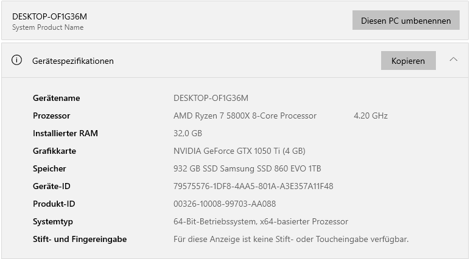

### Used Tools

- quemu-img 8.2.2
- exiftool 12.76
- hashcat 7.1.2

## Analysis

### Download and Import Forensic Image

The provided  [forensicImage.7z](https://seclva.ifs.tuwien.ac.at/forensicImage.7z) was downloaded, and verified that the SHA-1 is identical with the one provided in the assignment slide deck.

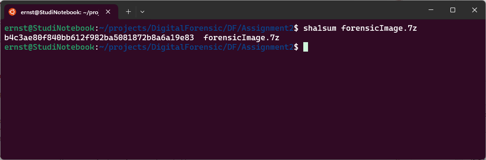

After extracting the image, the contained "DigitalForensic_AssignmentImage Clone.qcow" is converted into a raw image file via `qemu-img convert -f qcow -O raw DigitalForensic_AssignmentImage\ Clone.qcow image.raw`.

The converted image is then imported in `AutoPsy` having the following ingest modules activated:

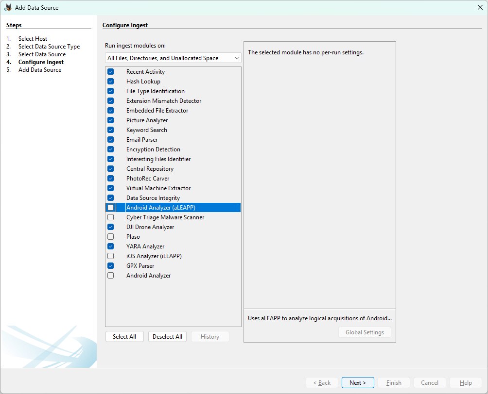

### Analysis Steps

#### OS and User Information

The ingested image shows four volumes, only `vol2` and `vol3` contain data. `vol2` is a boot partition, `vol3` contains the OS and user files which will be investigated further.

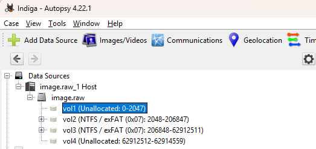

Autopsy provides the installed operating system in `Data Artifacts/Operating System Information`, the installed OS is "Windows 7 Professional, Service Pack 1". It also provides the name of the computer name, which is "HYRULE".
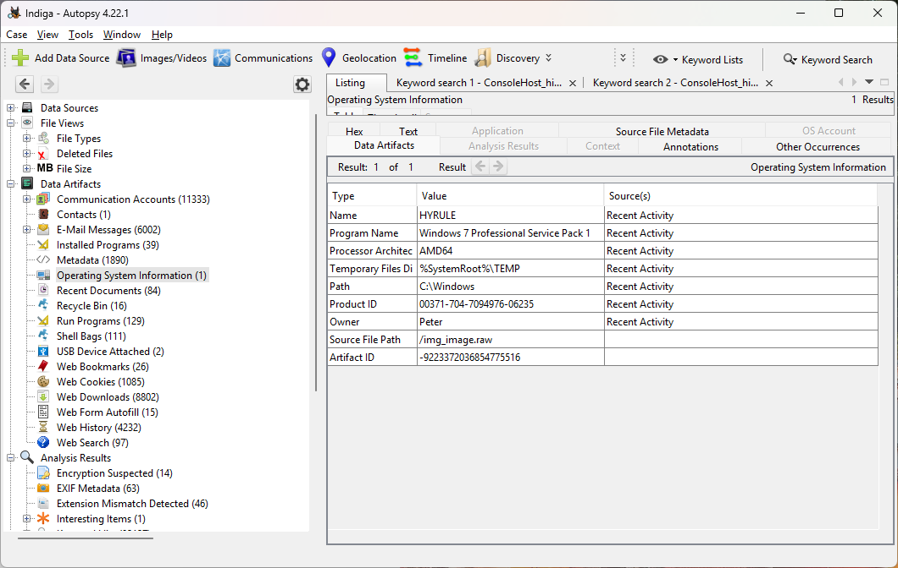

Details on when the OS was installed can be retrieved using the SOFTWARE registry hive in `Windows/system32/config/SOFTWARE`, then visiting the key `HKEY_LOCAL_MACHINE\SOFTWARE\Microsoft\Windows NT\CurrentVersion\InstallDate`. This key gives the seconds since January 1st 1970. The value is `1467847662`.

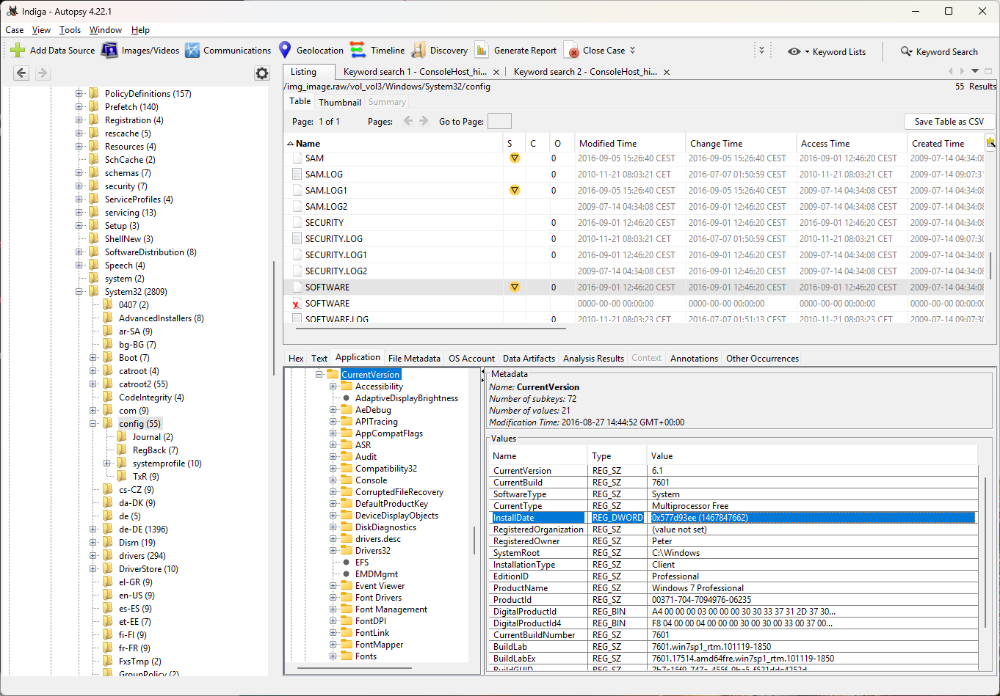

That value can be converted, e.g. in PowerShell via `Get-Date -Date ([System.DateTimeOffset]::FromUnixTimeSeconds(1467847662)).DateTime`. The date is `Wednesday, July 6, 2016 11:27:42 PM`.

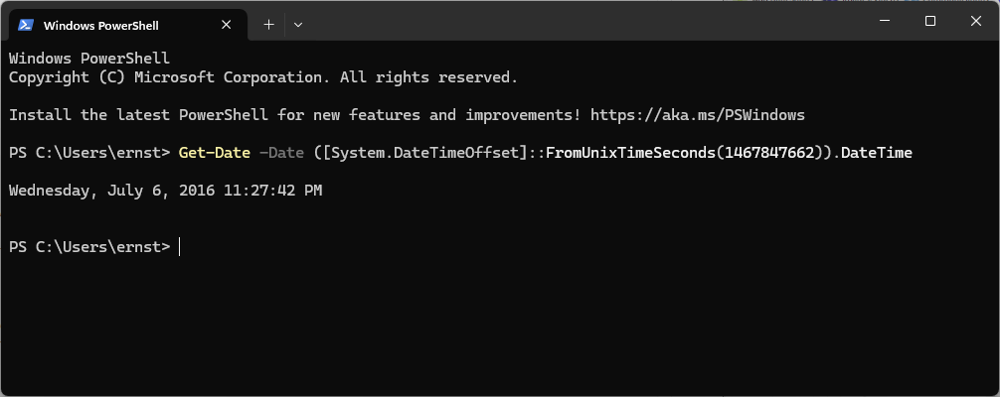

Autopsy provides the list of user accounts on that machine in its "OS Accounts" section, which provides the SID of user `peter`, which is `S-1-5-21-3032217210-630098460-752710606-1001`:
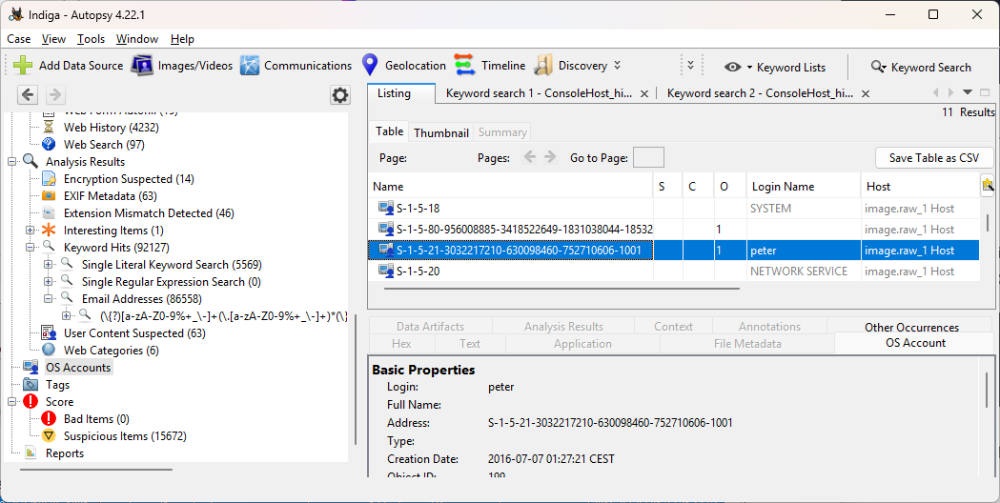

To find out when the computer was run for the last time, the system logs in `Windows/system32/winevt/logs` can be examined, and sorted according to the most recent "Modified Time" timestamp. The computer was run for the last time on September 5th, 15:28.

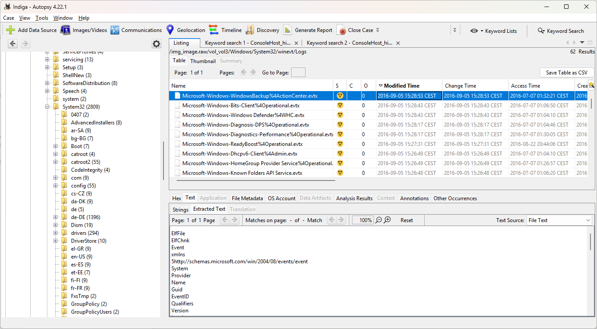

#### Malware

Ransom notes usually contain demands for money in a cryptocurrency. Doing a search for "Bitcoin" reveals a lucky strike, one was found in `Users/Peter/AppData/Roaming/_RECoVERY_+wdbic.txt`.

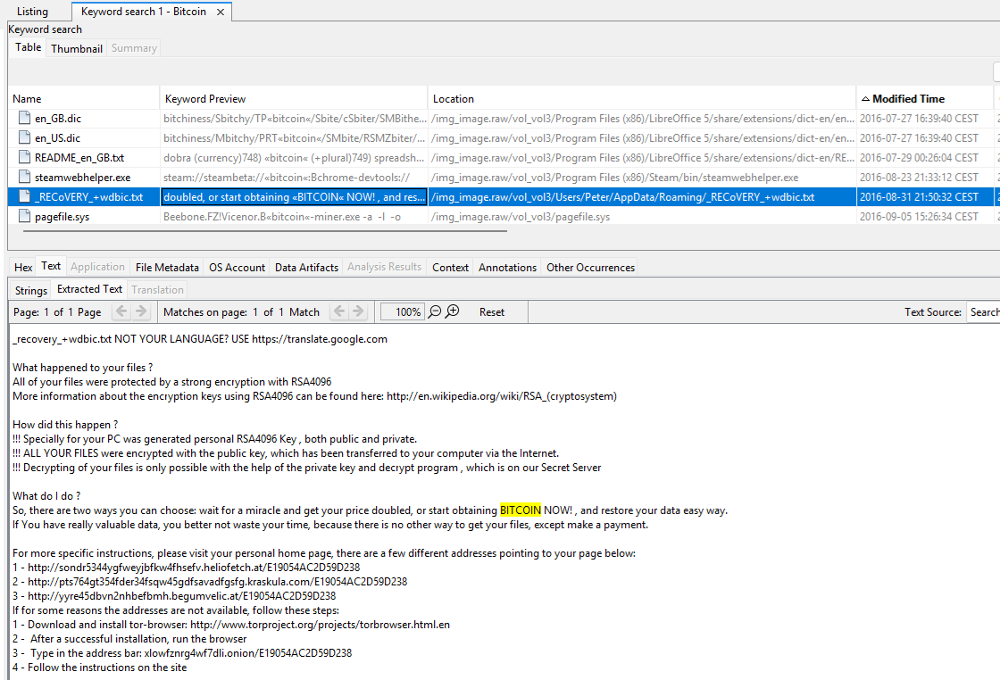

Extracting that file and uploading it to [https://id-ransomware.malwarehunterteam.com/](https://id-ransomware.malwarehunterteam.com/) identifies the malware either as `Magniber` or as `TeslaCrypt 0.x`. 
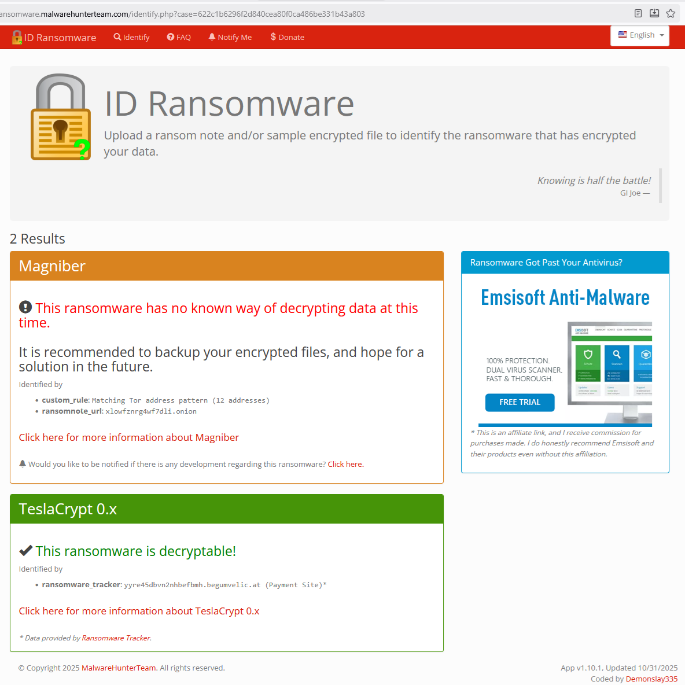

While a keyword search for `Magniber` does not provide findings, `TeslaCrypt` shows several results on the machine. Further investigation on that malware was done e.g. at [https://www.secureworks.com/research/teslacrypt-ransomware-threat-analysis](https://www.secureworks.com/research/teslacrypt-ransomware-threat-analysis)

The first idea for finding encrypted files on the file system is to look for files with high entropy. Autopsy stores a list files which it suspects of being encrypted in `Analysis Results/Encryption Suspected`. However, the file names and extensions do not indicate that these were encrypted by ransomware:
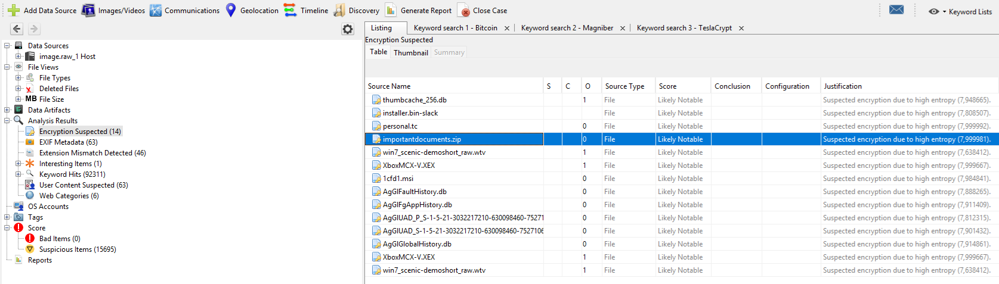

The second attempt uses the timestamp of the ransom note. According to the Meta-Data of the file, the modified timestamp indicates it was last changed on 2016-08-31, 21:50:32 CEST (see above). Unless the user changed that file by hand, the malware was active around that time. Autopsy comes with a "Timeline" tool which can help to correlate events that happens in a timeline close to each other. For finding manipulated files, only "file creation" events on the file system are collected, in the time frame from 31st of August 2016 to the 1st of September.

The timeline shows a block of new files created a few hours before "_RECoVERY_+wdbic.html" was last changed, between 19:00 and 20:00. This gives the list of encrypted files.


With the help of e.g. [support.eset.com](https://support.eset.com/de/kb6051-wie-entferne-ich-eine-teslacrypt-infektion-mithilfe-des-eset-teslacrypt-decrypter), the TeslaCrypt files can be restored again. The following image is one of the restored files. This shows that the the malware trace was in fact TeslaCrypt. 

| File Name | SHA256 |
|----------|----------|
|Leonard_Nimoy_William_Shatner_Star_Trek_1968.JPG|0c694331abd57274f0558fbe7cdd0a13e6dda993427cf2992ec5e832a44c1007|


As only a few files were affected by TeslaCrypt, the filter was extended to include all entries in the category "other", which revealed additional activity between 19:00 and 20:00. The entry indicates that the user sent an email using the sender address `peter1983@openmailbox.org`:

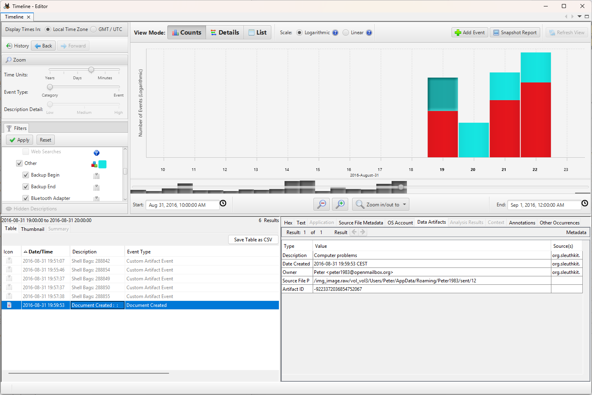

Looking into the respective entry reveals that `peter1983@openmailbox.org` sent a support request to `techsupportguy@mailinator.com`:

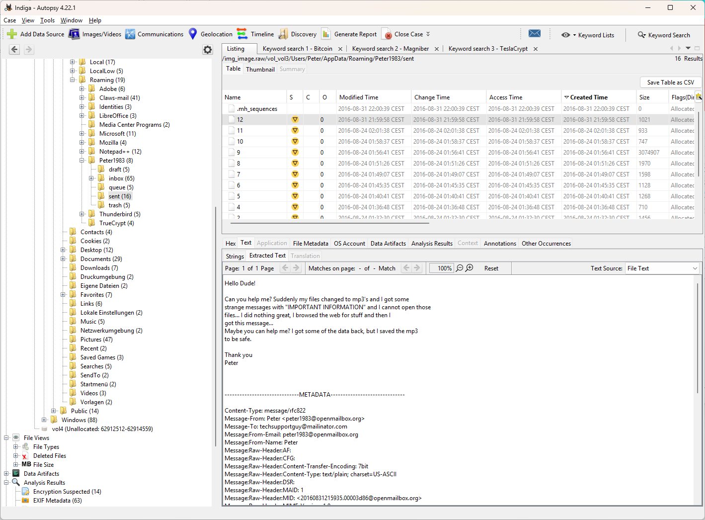

#### Information Theft

The email conversations of `peter1983@openmailbox.org` with `briennefan@openmailbox.org` reveal suspect content. On 2016-08-24, `briennefan@openmailbox.org`, between 1:39 and 1:50 repeatedly requests "design concepts" from `peter1983@openmailbox.org`. At 1:51:26, `peter1983@openmailbox.org` gives in to the request of "briennefan".

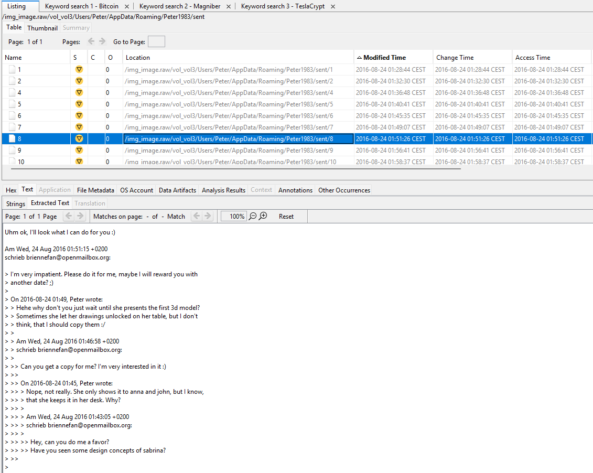

When looking at the timeline tool between 1:00 and 2:00, `peter1983@openmailbox.org` receives an email he sent from himself himself at 1:53:01. At 1:54:46, the file "/Private/Work/Info/IMG_20160823_130922.jpg" is created. Two minutes later, at 1:56:41, `peter1983@openmailbox.org` sends an email in which a file is enclosed with the same name:

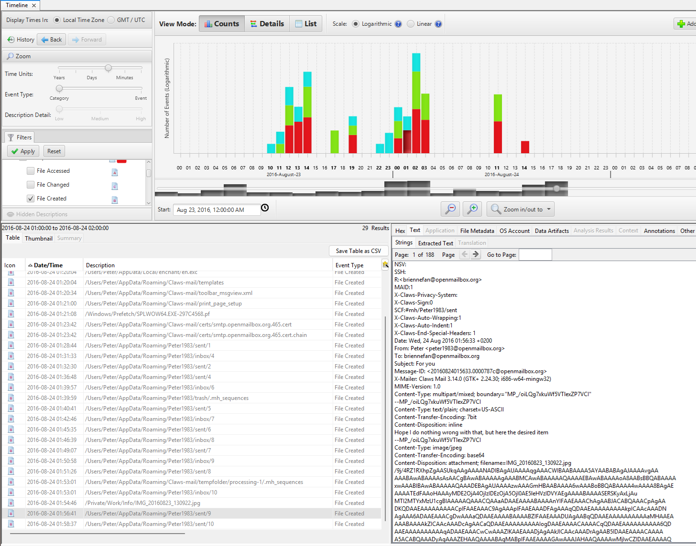

Exporting the email file `Users/Peter/AppData/Roaming/Peter1983/sent/9`, saving the base64 encoded attachment to encoded.txt, then encoding that file back into its binary form by `base64 -d encoded.txt >back.jpg` produces an exact copy of the file that was found in "/Private/Work/Info/IMG_20160823_130922.jpg", actually proving this file was sent to `briennefan@openmailbox.org`.

| File Name | SHA256 |
|----------|----------|
|IMG_20160823_130922.jpg|f304f09dc39ba8466ed0a9e6f27b2fd4327c6ef24778c0cfa0882ad7c5bd5a29|

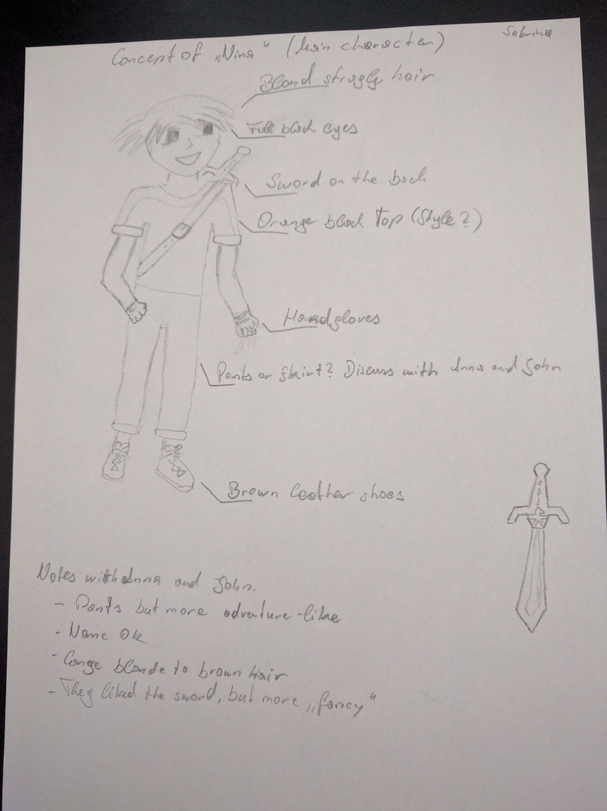

Running `exiftool back.jpg`, the binary that was converted back from the base64 encoded attachment, reveals that the image has been taken with an LG Nexus 5x smartphone. No GPS location data is contained in the image. It is likely that the email `peter1983@openmailbox.org` sent to himself was sent from that device. The creation date in the EXIF data is consistent with the email conversation timeline.

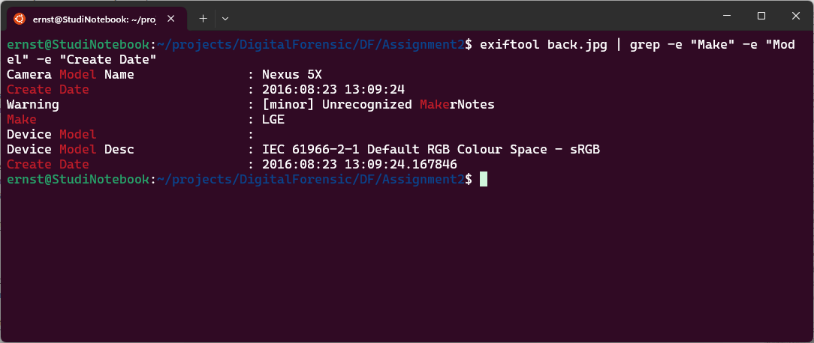

As the email conversation is stored in the user folder of user "peter", the email account `peter1983@openmailbox.org` can be connected to the user peter. However the identity of `briennefan@openmailbox.org` is not revealed. There is a follow-up email of `peter1983@openmailbox.org` which gives away that `briennefan@openmailbox.org` actually is Iris, a coworker of peter:

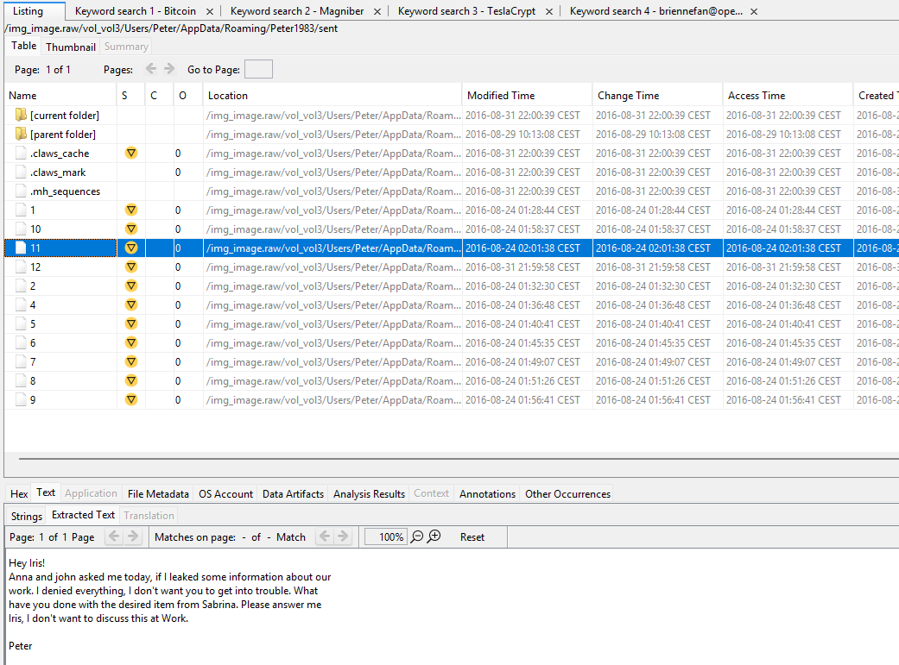

#### Additional Information

Autopsy shows one file with high entropy, `Users/Peter/Documents/personal.tc`. The suffix indicates a TrueCrypt volume. Running it through hashcat using the `rockyou.txt` word list and the `best66.rule` rule set for password mutations reveals the password, which is 'sec1'.

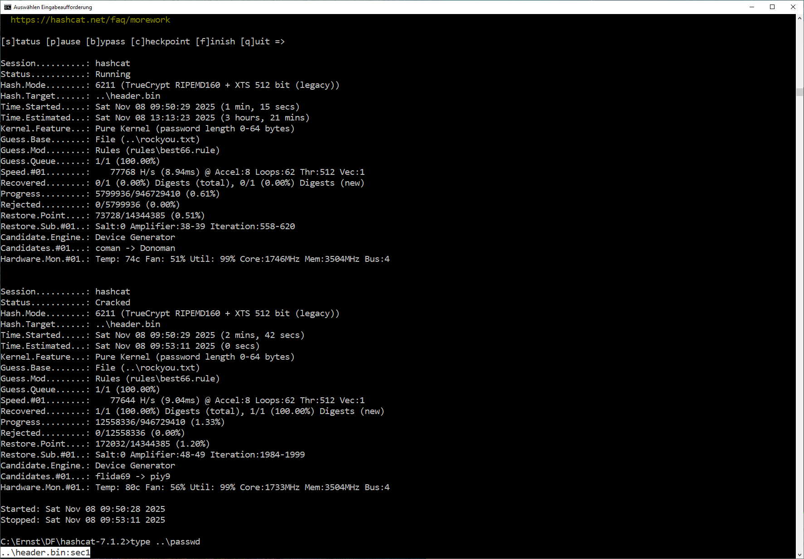

Using the password, the volume can be mounted e.g. with [truecrypt](https://www.truecrypt.org/downloads), it contains the files

| File Name | SHA256 |
|----------|----------|
|workinfo.docx|d1656f9c44fff77bd23092f58eab82ebab329e8088ea5a0a36418f79041ec2b9|
|contacts.xlsx|5e7e2941c0a850b13532a31576cae0c2920f98ef0c765c92c6d3458adcc810c6|
|iris.jpg|4856cee29229962f04a56d699151409991f0edf171adc800bede66deb49dddf7|
|passwords.xlsx|32e451f2d3044d2f396075ae5bbff8d8645ec7e18a4aa1bce505d8e9c9862f2b|


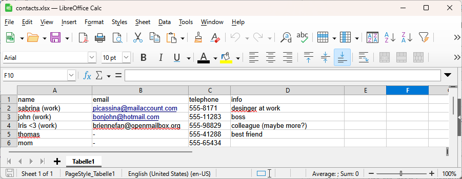
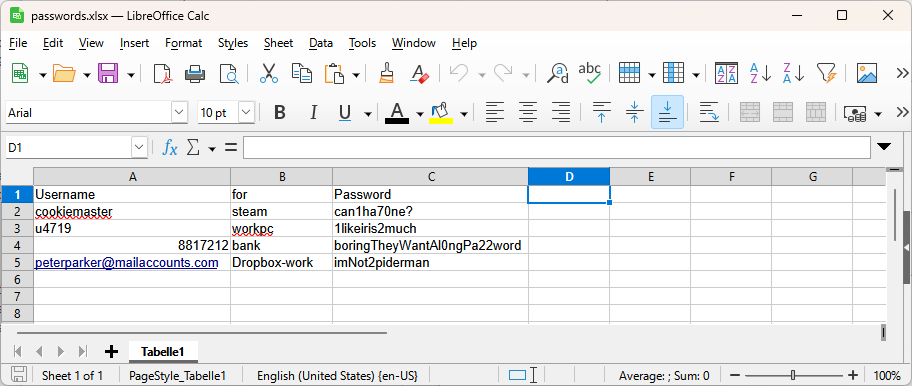


`contacts.xlsx` confirms that `briennefan@openmailbox.org` actually is Peters coworker, Iris. Moreover, doing a google image search for `iris.jpg` reveals she is also part time working as a model for a stock photo agency :-).
The content of `contacts.xlsx`, `passwords.xlsx`, a .pdf on peters Desktop "Als mir die Iris zugelaufen ist ... Eine Kurzgeschichte von Karl Hillebrand.pdf" suggests that Peter has romantic feelings towards Iris. A keyword search on "Iris" reveals that he was searching for her presence on Facebook and was googling her as a game developer.

### Expert Testimony
>What information was stolen?  
>Which persons were involved in the case?

A design concept, created by Sabrina at Indiga was sent to `briennefan@openmailbox.org`, a private email address of Iris who is working as a game developer at Indiga. The email was sent from the private email account of Peter, `peter1983@openmailbox.org` on August 24th, 2016 at 1:56:41.

>What operating system was used?

Windows 7 Professional, Service Pack 1

>What is the computer’s name?

The computer's name is "HYRULE".

>When was the operating system installed, when was it running the last time?

The OS was installed on Wednesday, July 6th, 2016 at 11:27:42 PM. The PC was running the last time on September 5th 2016, at 3:28 PM.

>What is the SID (Security Identifier) for the user Peter?

The SID of user Peter is `S-1-5-21-3032217210-630098460-752710606-1001`.

>Can you find traces of malware on the system? If yes...  
>What kind of malware is it and how did you find it?  
>Which data is affected? Is it possible to restore the affected data?  

Traces of the "TeslaCrypt" malware were found on the system. The malware was found by detecting the ransom message. The malware generated the following encrypted files on the system:

| File Name | SHA256 |
|----------|----------|
|Private/Personal/unityassetstoreguide.pdf.mp3|8207800f2c16dbd10761c56b8f51ceacc81a903c3a56cc6276a214fce519a3f8|
|Program Files/companydata.csv.mp3|25040e634fbec32e1d9a603449b7b123442cd0b48e1824149a8fe7fc356d2b82|
|Program Files/Computing_short19.pdf.mp3|9d3bd13c6185e95794307ec921fb5ae2dd9dd170069dbb7fa776e9d27b311fe8|
|Users/Peter/Downloads/contactdata.csv.mp3|d0ee8874981362ed0d8996eab4971a9396e6f3e5fd92e8704e5855bebcfb774e|
|Private/Work/Fallen_Champions_concept_art_3.jpg.mp3|0c3e1169500f9a3785eb5e9da3d7379de9c074f7bf7895c88e541c73a278be75|
|Private/Work/Fungus-Documentation.pdf.mp3|dd9f29a9f85f5bd0f82834505f147e9c253fee57362e2dc6e8b9a8c5d53a8778|
|Private/Stuff/IMG_20160823_130922.jpg.mp3|029c908c65c46f02864e383d59530c8f9e220a2e773bcf5195f83ccebe2dddb1|
|Private/Personal/Leonard_Nimoy_William_Shatner_Star_Trek_1968.JPG.mp3|d615d05406e05db72d9e7e11562d82282f3d7ea43940e06a8b6b2dbcb55542b8|
|Private/Personal/monster_concept_art_vii_by_d_faultx.jpg.mp3|db36a951df881c72196f2e8411b714a6b88f95a5e0111006f5b0c1aa0d638bc8|
|Private/Personal/myrating.csv.mp3|edf10e3546d275524998dc320e523898133b0dc508929d7a20432f696521b6ce|
|Private/Personal/passwords.docx.mp3|03aaa98983c2b1d385d96805bf742d95dc582fca4fa2d79ac7a7d9b1cc68a6c4|

The encrypted files can be restored.
