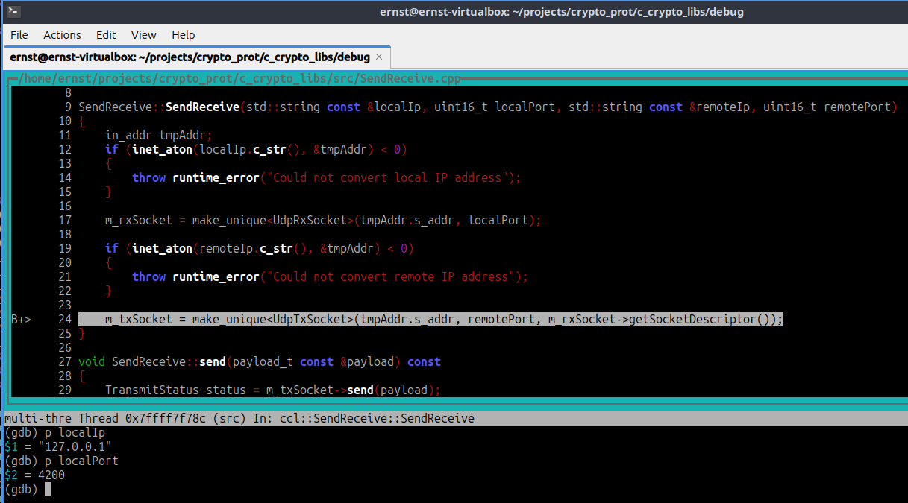
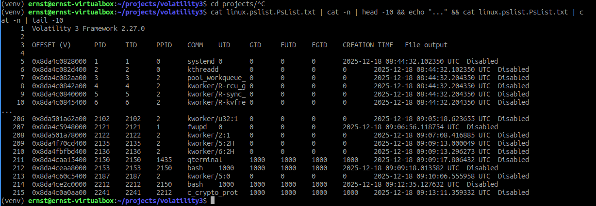
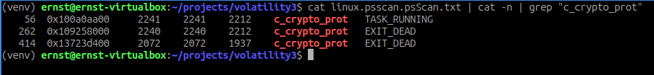
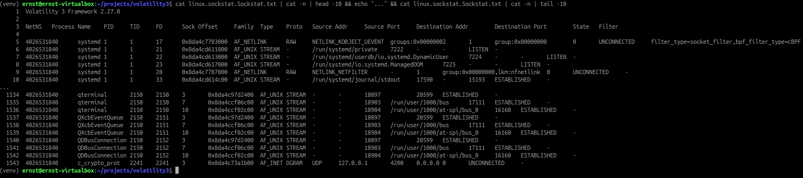
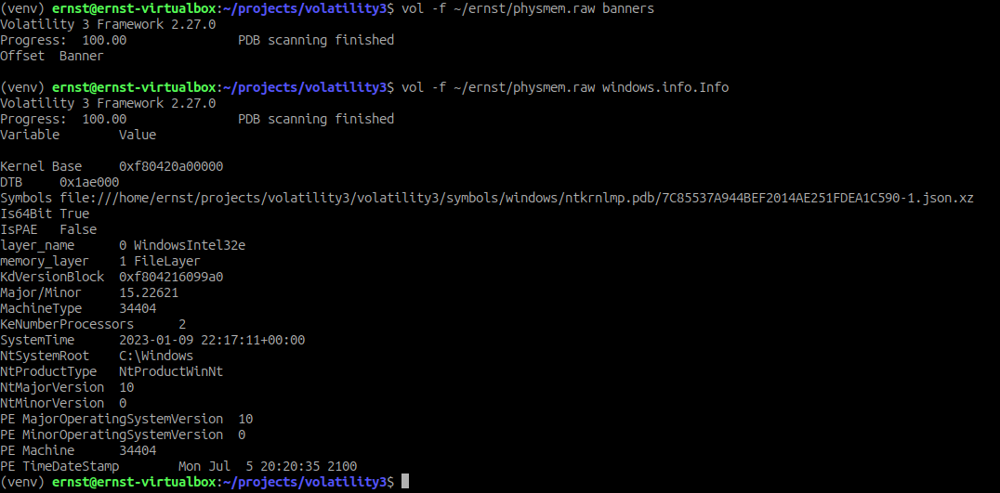
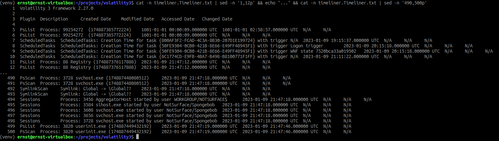
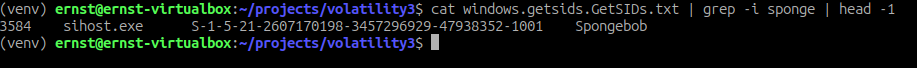
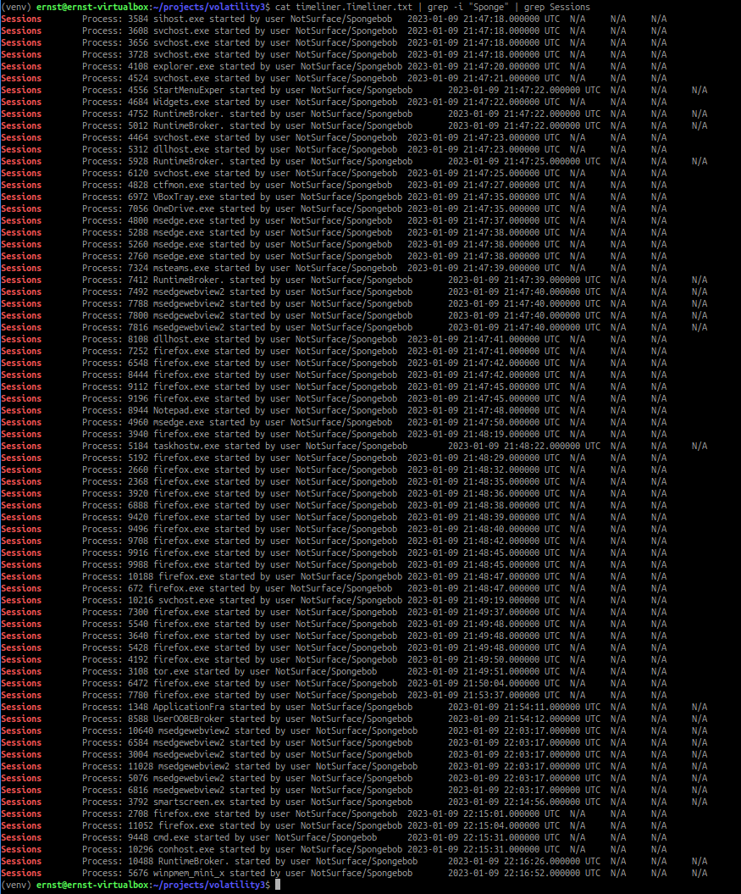
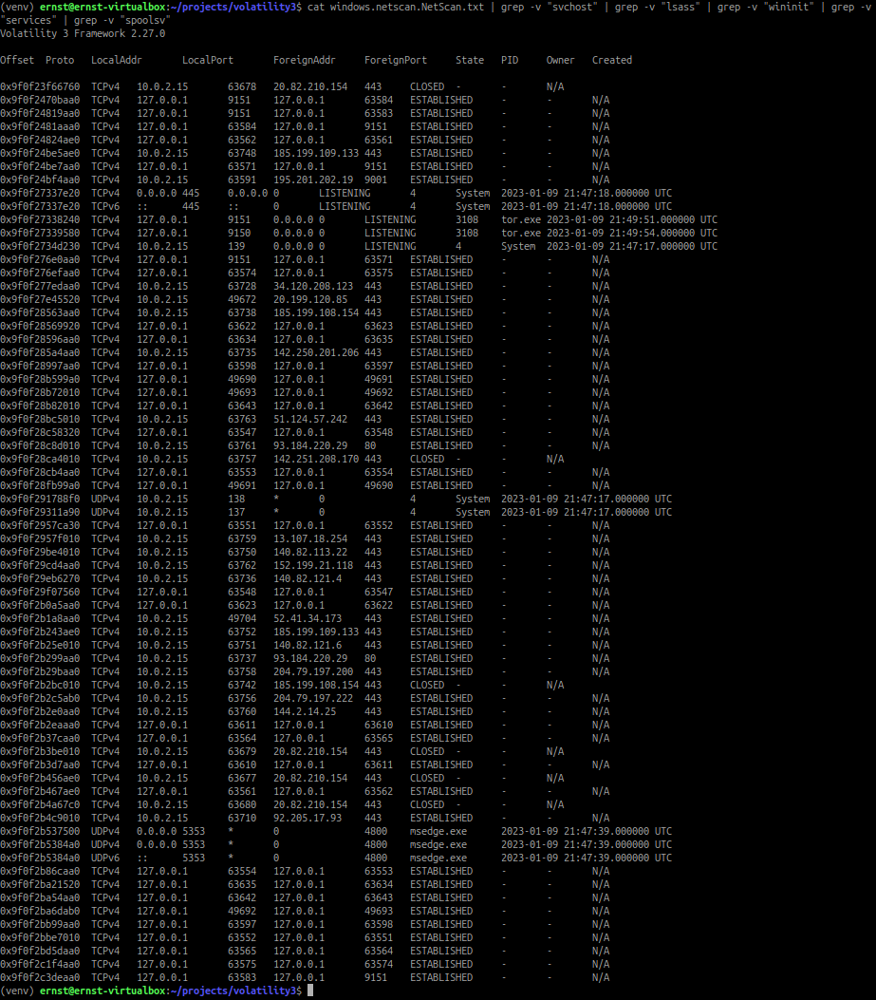

# Assignment 3: RAM

Student: Ernst Schwaiger

## Acknowledgments

Thanks to Kamil Mankwoski who gave the information that the current volatility3 project cannot correctly parse memory dumps of recent Linux Kernels. Alternatively a fork of that project must be used: https://github.com/Abyss-W4tcher/volatility3.git, branch issue_1761_module_sect_attr_fix.

## Analysis Environment

For the subsequent analysis steps, a Lubuntu 24.04 VM was installed in VirtualBox, Version 7.1.6 r167084 (Qt6.5.3), running on a Windows 11 host operating system. The underlying hardware hosts an AMD Ryzen 7 PRO 4750 CPU, clocked at 1.7GHz, and 32GB of RAM. In VirtualBox, half of the 12 total (hyper threading) processor cores are assigned to the Lubuntu virtual machine. The VMs RAM was configured at 8GB. The VMs name is "lubuntu2402new".

The following image was used for the Lubuntu installation:
https://cdimage.ubuntu.com/lubuntu/releases/noble/release/lubuntu-24.04.3-desktop-amd64.iso

## Generate a Memory Dump of an Operating System
> Your first task is to demonstrate your overall forensic capabilities and acquire a RAM dump of an operating system of your choosing!

After the installation of "lubuntu2402new", the VM is started, the default user is logged in. In a shell, the application `c_crypto_prot` is started. It opens a UDP socket on `127.0.0.1`, the localport number being `4200`. This is the artifact to look for in the memory dump.



In the next step, the memory dump can be extracted to `lubuntu-core.dump` using the `VBoxManage.exe` tool on the Windows host system:

```cmd
"C:\Program Files\Oracle\VirtualBox\VBoxManage.exe" list vms
"C:\Program Files\Oracle\VirtualBox\VBoxManage.exe" debugvm "lubuntu2402new" dumpvmcore --filename lubuntu-core.dump
```

## Analyze the memory dump

>Your second task is to analyze the just acquired RAM dump  using volatility:
>- list all the running processes
>- list all the network connections
>- make sure to not list, but scan too & discuss the differences
>- verify that you also find your previously included unique artifact

For the purpose of this exercise, the analyzed VM will also be used to conduct the analysis. At first, `volatility3` and its dependencies are installed on the system (not the canonical repo, but the fork mentioned above):

```bash
sudo apt install python3-pip
sudo apt install python3-venv
git clone https://github.com/Abyss-W4tcher/volatility3.git
cd volatility3/
git switch issue_1761_module_sect_attr_fix
python3 -m venv venv && . venv/bin/activate
pip install -e ".[dev]"
```

In the second step, the debug symbols for the running kernel must be installed, the instructions given in https://www.iblue.team/memory-forensics-1/volatility-plugins/build-custom-linux-profile-for-volatility were followed for that purpose:

Create `/etc/apt/sources.list.d/ddebs.list` with the following content:
```bash
deb http://ddebs.ubuntu.com noble main restricted universe multiverse
deb http://ddebs.ubuntu.com noble-updates main restricted universe multiverse
deb http://ddebs.ubuntu.com noble-proposed main restricted universe multiverse
```

Add the `dbgsym-release-key.asc` key to the trusted keys of apt:
```bash
wget -O - http://ddebs.ubuntu.com/dbgsym-release-key.asc | sudo apt-key add -
```

Install the symbols for the currently installed kernel:
```bash
sudo apt update
sudo apt install linux-image-6.14.0-37-generic-dbgsym
```

Reboot the system, then install golang, checkout and build `dwarf2json`:

```bash
sudo apt install golang-go
git clone https://github.com/volatilityfoundation/dwarf2json.git
cd dwarf2json
go build
```

Generate the symbol table for the running OS, copy it into the symbols folder, so volatility can find it:
```bash
sudo ./dwarf2json linux --elf /usr/lib/debug/boot/vmlinux-6.14.0-37-generic --system-map /boot/System.map-6.14.0-37-generic > ~/projects/volatility3/volatility3/symbols/Lubuntu24.04-6.14.0-37-generic.json
```

The following commands generate the lists of 
- running processes 
- running & terminated processes
- open sockets at the point in time the memory dump was taken:

```bash
python3 vol.py -f ~/ernst/lubuntu-core.dump linux.pslist.PsList >linux.pslist.PsList.txt
python3 vol.py -f ~/ernst/lubuntu-core.dump linux.psscan.PsScan >linux.psscan.psScan.txt
python3 vol.py -f ~/ernst/lubuntu-core.dump linux.sockstat.Sockstat >linux.sockstat.Sockstat.txt
```

Examining `inux.pslist.PsList.txt` yields (215 - 4) = 211 running processes. The last entry in the list, `c_crypto_prot`, is the process to look for. It was invoked by the default user, UID, GID, EUID, EGID all are 1000.



The examination of `linux.psscan.psScan.txt` yields (453 - 4) = 449 processes that are running, or have already terminated.


While the process list gives more details, the user account by which it is executed, and the time of process creation, only active processes are displayed. The process scan also gives information about processes which have terminated in the meantime.

When applying the filter for processes executing the `c_crypto_prot` application two additional processes are displayed which have already terminated, along with the running process which also appears in the list above:



The file `linux.sockstat.Sockstat.txt` shows the list of sockets, along with their type, port number, status, and the processes holding them:



The very last entry shows the socket of `c_crypto_prot` on `127.0.0.1`, which listens on port `4200`. `AF_INET DGRAM` indicates an IPV4 UDP Socket, which corresponds with the debugger output above.

## Analyze provided memory dump

### Analysis part

>Someone sent you a RAM dump to challenge your skills:
>- download the RAM dump from here 
>- SHA-256 of physmem.raw: fee4a87527509ed8a67c51a2b3e21a74ae52739e0d69020312180339cfd79e3b
>- and answer the questions on the next slide
>Questions:
>- What information can you extract about the operating system?
>- What happened at the time of the RAM dump:
>- e.g., date, time, ...
>- running processes, network connections, ... 
>- are all the browsers the same?
>- what is the user SID?
>- can you find/crack the user password (and get a hint who sent you the RAM dump)?
>- if you encounter an HBootkey error, use BCF8548EAE42900BEDA0F150E16504B5

The archive containing the RAM dump was downloaded from https://seclva.ifs.tuwien.ac.at/physmem.zip. After download and extraction, the checksum is verified: `sha256sum ~/ernst/physmem.raw`, yielding `fee4a87527509ed8a67c51a2b3e21a74ae52739e0d69020312180339cfd79e3b`

#### What information can you extract about the operating system?
In the first step, `volatility3` is used to look for Linux banners, none are found, running the query for a Windows OS shows:



`NtMajorVersion = 10` and `NtMinorVersion = 0` indicate Windows 10, `Is64Bit True` indicates a 64 bit OS, `PE Machine      34404` and `MachineType     34404` identify the hardware platform running the OS, which is "x86-64/AMD64".

Extracting the `PROCESSOR_IDENTIFIER` environment variables of the executing processes reveals "AMD64 Family 25 Model 80 Stepping 0, AuthenticAMD", indicating either a Ryzen 5000‑series desktop processor, or a EPYC Milan processor.

#### What happened at the time of the RAM dump
>- e.g., date, time, ...
>- running processes, network connections, ... 
>- are all the browsers the same?

Running `python3 vol.py -f ~/ernst/physmem.raw timeliner.Timeliner >timeliner.Timeliner.txt` captures the timeline out of the dump. The timeline reveals that the (local) system time when the memory dump was taken is "2023-01-09 22:17:11". The login process started around "2023-01-09 21:47:12..21:47:19"



The subsequent entries in the timeline indicate the logged in user is `NotSurface/Spongebob`. Running `python3 vol.py -f ~/ernst/physmem.raw windows.getsids.GetSIDs >windows.getsids.GetSIDs.txt` reveals the User Id `S-1-5-21-2607170198-3457296929-47938352-1001` of that account:



For getting an overview on what that `Spongebob` user did until the memory dump was taken:



The user started the Edge browser `msedge.exe`, and several instances of Firefox, `firefox.exe`. The `tor.exe` entry indicates that the Firefox instance executed at `2023-01-09 21:49:50` is actually a Tor browser. The last four entries indicate that the user opened a console and launched `winpmem_mini_x`, which produced the examined memory dump. Additional applications started by the user include `msteams` and `Notepad`.

The entry `VBoxTray.exe` indicates that the OS is not installed natively, but runs in a VirtualBox hypervisor.

The active and closed network connection can be retrieved via `python3 vol.py -f ~/ernst/physmem.raw windows.netscan.NetScan > windows.netscan.NetScan.txt`. Filtering out the less interesting ones shows the list below:



The interesting remote IP addresses are listed in the table below

RemoteIp | Port | domain name/owner |
---------|------|-------------------|
20.82.210.154   | 443 | owned by MS Azure |
185.199.* | 443 | github.com |
195.201.202.19  | 9001 | hosted by Hetzner |
34.120.208.123 | 443 | 123.208.120.34.bc.googleusercontent.com |
20.199.120.85  | 49672 | unknown |
142.250.201.206 | 443 | bud02s35-in-f14.1e100.net |
51.124.57.242 | 443 | owned by MS Azure |
93.184.220.29 | 80 | unknown |
142.251.208.170 | 443 | lcfraa-bl-in-f10.1e100.net |
13.107.18.254 | 443| owned by MS Azure |
140.82.* | 443 | github.com |
152.199.21.118 | 443 | owned by Verizon Business |
52.41.34.173 | 443 | ec2-52-41-34-173.us-west-2.compute.amazonaws.com |
204.79.197.200 | 443 | a-0001.a-msedge.net |
204.79.197.222 | 443 | owned by MS Azure |
144.2.14.25 | 443 | LinkedIn |
92.205.17.93 | 443 | 93.17.205.92.host.secureserver.net/GoDaddy |

The entry `195.201.202.19` on port `9001` likely is the connection the Tor browser is using.

Regarding the password hash of user `NotSurface/Spongebob`, both
`vol -f /home/ernst/ernst/physmem.raw windows.lsadump.Lsadump` and `vol -f /home/ernst/ernst/physmem.raw windows.registry.lsadump.Lsadump` return a warning that the boot key could not be found. Investigating that further would have made sense, due to lack of time, the investigation has to stop here.

In the last step an examination was done to ensure the passed memory dump has not been altered inadvertently:

```bash
sha256sum ~/ernst/physmem.raw
fee4a87527509ed8a67c51a2b3e21a74ae52739e0d69020312180339cfd79e3b  /home/ernst/ernst/physmem.raw
```

The identical hashes indicate that the memory dump was not altered during the investigation.

### Witness Report

The following questions had to be answered:

>Questions:
>- What information can you extract about the operating system?

The OS is a Windows 10, 64-bit OS, executing on an x86-64/AMD64 processor. The processor identifies as AMD64 Family 25 Model 80 Stepping 0, AuthenticAMD", indicating either a Ryzen 5000‑series desktop processor, or a EPYC Milan processor. The `VBoxTray.exe` entry in the timeline process list indicates that the OS was installed using a VirtualBox hypervisor.

>- What happened at the time of the RAM dump:
>- e.g., date, time, ...
>- running processes, network connections, ... 
>- are all the browsers the same?

The login process started around "2023-01-09 21:47:12..21:47:19" local time. The time at which the dump was taken is "2023-01-09 22:16:52". The user `NotSurface/Spongebob` started the following applications after login:

- MS Edge browser, `msedge.exe`
- Firefox, `firefox.exe`, in regular mode, and as a Tor browser
- MS teams, and Notepad were started as well

The list of network connections indicate that the Tor browser connected to the remote IP address `195.201.202.19`and port `9001`. That host is owned by Hetzner.

>- what is the user SID?

The user name and SID are `NotSurface/Spongebob` and `S-1-5-21-2607170198-3457296929-47938352-1001`.

>- can you find/crack the user password (and get a hint who sent you the RAM dump)?
>- if you encounter an HBootkey error, use BCF8548EAE42900BEDA0F150E16504B5

The RAM dump was created by the user `SpongeBob` however, password hash and password were not extracted due to lack of time.
