# Assignment 4: Smartphone

Student: Ernst Schwaiger

## Analysis Environment

For the subsequent analysis steps, the `Cellebrite Reader` Application was used on a Windows 11 system. The exact version number is shown below:

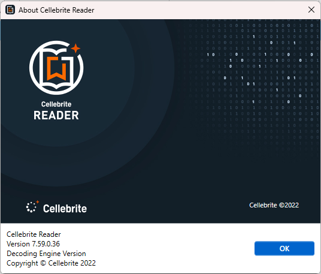

Wherever possible, the information discovered in `Cellebrite Reader` was verified by inspecting the related files on the Android file system.

## Assignment

The assignment was to analyze the file system state taken from a cellphone owned by a person named Heisenberg such that the questions below can be answered:

>The smartphone’s owner, called Heisenberg, was arrested for allegedly dealing with stolen cars.  
>Your job: figure out if is that really the case?  
>Questions (12 points):  
>Are there clues or evidence for Heisenberg dealing with (stolen) cars? (2 points)  
>Heisenberg used his cellphone during the arrest. Did he create any recordings of the arrest? Note: arrest took place on 2021-07-20 (1 point)  
>Are there any hints that the police did not quite follow best practices in handling the cellphone during/after the arrest? If so, what did they do wrong? (1 point)  
>Are there any clues for Heisenberg taking an interest in cryptocurrency? (2 points)  
>Did Heisenberg use any apps for file hiding or encryption? (1 point)  
>Are there any clues for Heisenberg connecting or planning to connect external drives to his Cellphone? (1 point)  
>Was the image with the MD5 hash “066858f4b1971b0501b9a06296936a34” hidden by Heisenberg? If yes, what app was used? (1 point)  
>Where did Heisenberg plan to meet with the owner of the telephone number “+15402993169”? (1 point)  
>At which time(s) did Heisenberg actively use the Signal app on 2021-07-14? (2 points).

## Resolving Questions

>Are there clues or evidence for Heisenberg dealing with (stolen) cars? (2 points)  

The device contains a video in `data/media/0/DCIM/Camera/20210720_150222.mp4`, in which a person, presumably Heisenberg, records a conversation in which he tries to sell a car. The potential customer seems to be an undercover police officer who arrests Heisenberg after checking the VIN. It turns out, the VIN belongs to a stolen vehicle.

Moreover, the cell phone has installed several applications installed for purchasing or selling cars:

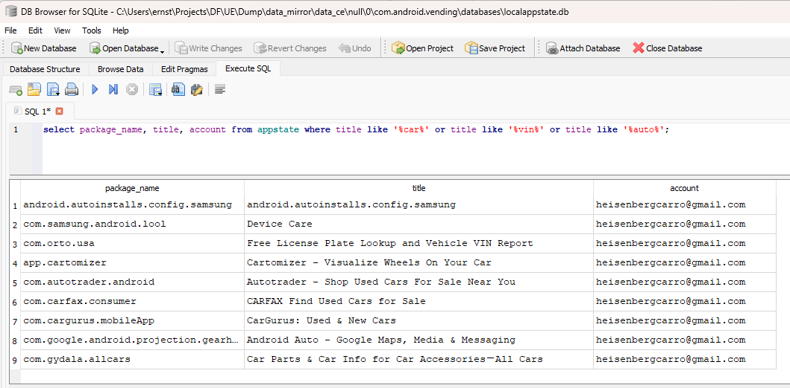

In addition to that, several conversations regarding the sale and purchases of vehicles could be found on the cell phone, e.g.:

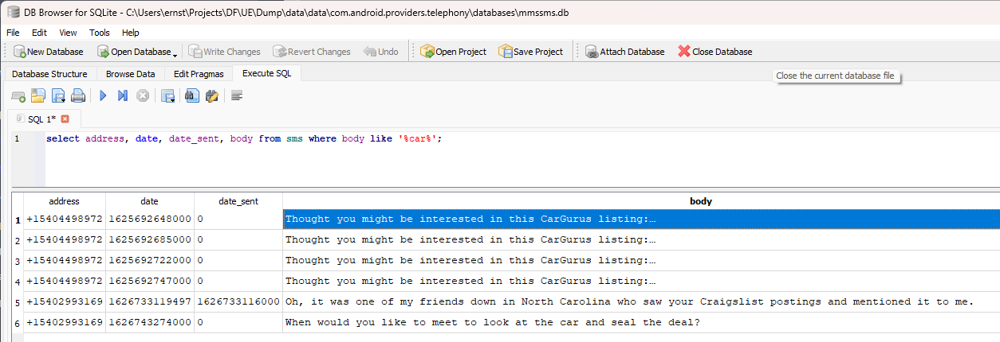

In addition to that lots of pictures of cars or car related products can be found, e.g. the rear side of a Honda, or a picture of an OBD analysis device:


>Heisenberg used his cellphone during the arrest. Did he create any recordings of the arrest? Note: arrest took place on 2021-07-20 (1 point)

Yes, he recorded his own arrest. The video can be found in `data/media/0/DCIM/Camera/20210720_150222.mp4`.

>Are there any hints that the police did not quite follow best practices in handling the cellphone during/after the arrest? If so, what did they do wrong? (1 point)  

After the arrest happened on July 20th, 2021, around 15:02 local time/19:02 UTC, the cell phone is evidence and should have been taken from the suspect and put into a Faraday bag to prevent any direct or remote tampering. However, the Cellebrite `Network Usages` view still shows **network traffic after the arrest**, i.e. the cell phone has *not* been put into a Faraday bag, hence best practices have not been followed.

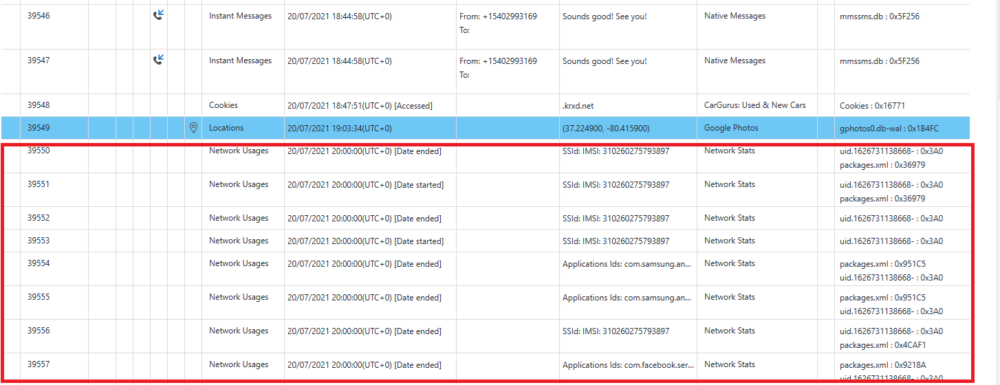

For instance, in `data/system/packages.xml`, an entry with timestamp "17ac545aa38" can be found. The value denotes the milliseconds passed since 1970-01-01:00:00, and translates to UTC "Tue Jul 20 20:55:15 CEST 2021". This package should not have been logged had the cellphone been properly handled by the police.

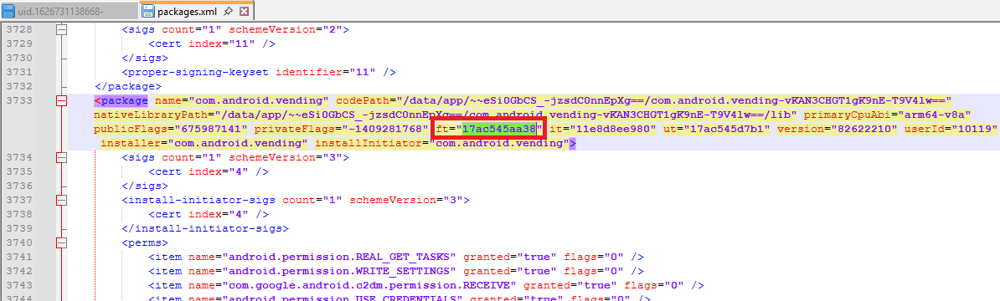

After the arrest, Beth Dutton was texted from the cell phone and an appointment was made to meet on the 21st of July at 5 o'clock in the "Vienna Inn" in Vienna, VA.

>Are there any clues for Heisenberg taking an interest in cryptocurrency? (2 points)  

The twitter cache file `data/media/0/Android/data/com.twitter.android/cache/image_cache/v2.ols100.1/33/_EsC0g3zTIiQYBhWKAo0Rr0wUlc.cnt` contains a diagram on the bitcoin/$ rate titled "Crash course in confirmation bias", the image `data/media/0/Android/data/com.twitter.android/cache/photos/61397bc23f3dbda78005293e4ff1ca63.0` of the `ItsDogeCoin` Twitter/X account indicates that Heisenberg is following this account.

In Heisenbergs email inbox for `heisenbergcarro@gmail.com`, there are a number of notification emails from Twitter/X, informing about news related to crypto currencies. The database containing the messages is `data/data/com.google.android.gm/databases/bigTopDataDB.-1285600966`. Since the messages are stored as protobufs in blob fields, they cannot easily be extracted using an SQLite browser.

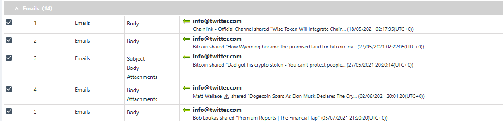

>Did Heisenberg use any apps for file hiding or encryption? (1 point) 

He has installed the [HideX](https://play.google.com/store/apps/details?id=calculator.lock.vault.hide&hl=en-US) app.
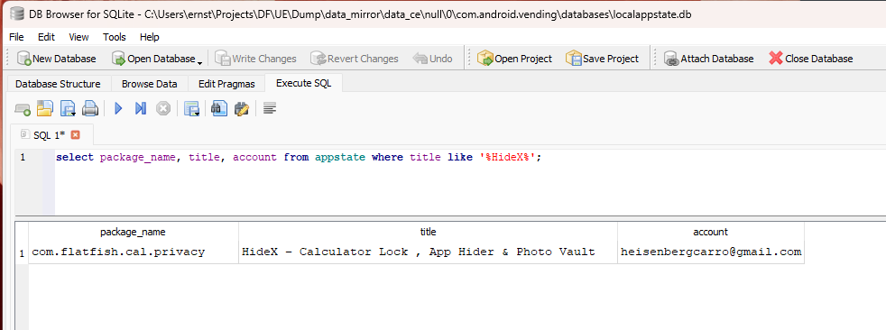

>Are there any clues for Heisenberg connecting or planning to connect external drives to his Cellphone? (1 point)  

Heisenberg did some related searches in the installed Google Chrome browser, the timestamps `13266351328099866`, `13266352342667868` are webkit timestamps which can be converted by this [online tool](https://www.epochconverter.com/webkit), and indicate the searches were done on May 24, 2021 5:35:28 PM Greenwich Mean Time. Assuming Heisenberg used the cell phone in Virginia, the local time would be 1:35 in the afternoon.


>Was the image with the MD5 hash “066858f4b1971b0501b9a06296936a34” hidden by Heisenberg? If yes, what app was used? (1 point)  

Yes, the file was hidden using the HideX application. The file with the given MD5 hash is located in 
`data/data/com.flatfish.cal.privacy/cache/image_manager_disk_cache/7ae6e97ba4ad0d693413273d6e270a412af3331a9c96c7a9049e3ae9b6047c9d.0`. `com.flatfish.cal.privacy` is the package name of the HideX app, see the `package_name` field in the query above.

>Where did Heisenberg plan to meet with the owner of the telephone number “+15402993169”? (1 point)  

The SMS conversation with the customer identified by the number `+15402993169` can be retrieved from `data/data/com.android.providers.telephony/databases/mmssms.db`:

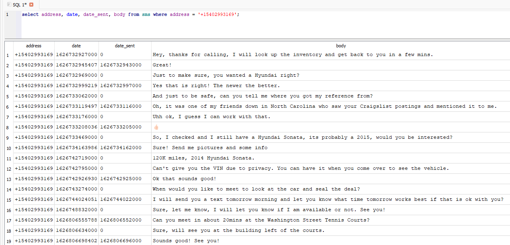

The Google Photos app stored the respective location in its write-ahead log `data/data/com.google.android.apps.photos/databases/gphotos0.db-wal`, (37.224900, -80.415900), which is Blacksburg VA, and is consistent with the directions Heisenberg gave in the SMS conversation.

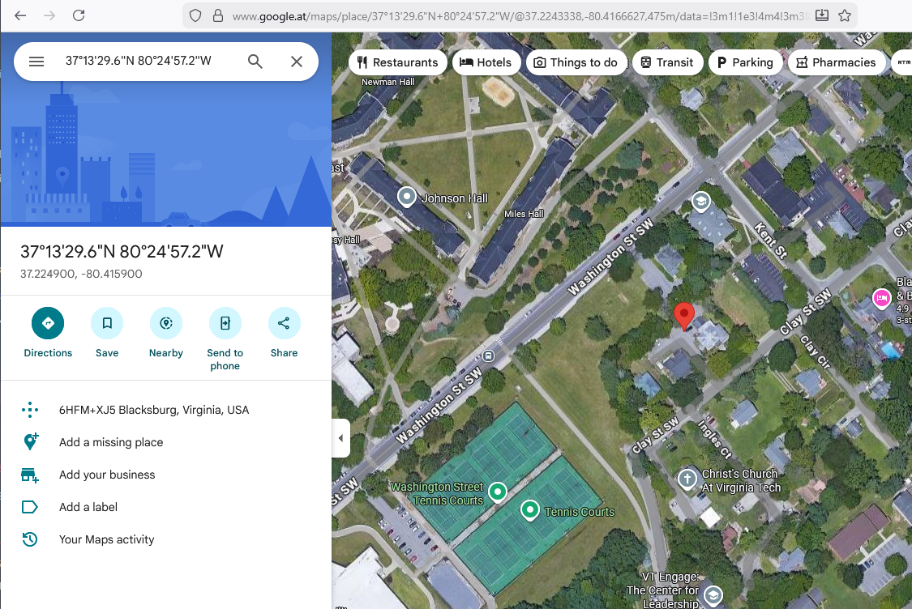

>At which time(s) did Heisenberg actively use the Signal app on 2021-07-14? (2 points).  

As the databases of the signal app are encrypted, that information must be taken from somewhere else, e.g.  `data/system/appops.xml` logs when apps are executing specific operations. The signal app id on the cellphone can be taken from `data/system/packages.xml`, where a `package` entry associates the package "org.thoughtcrime.securesms" (i.e. the Signal app) with the `userId` ="10303".

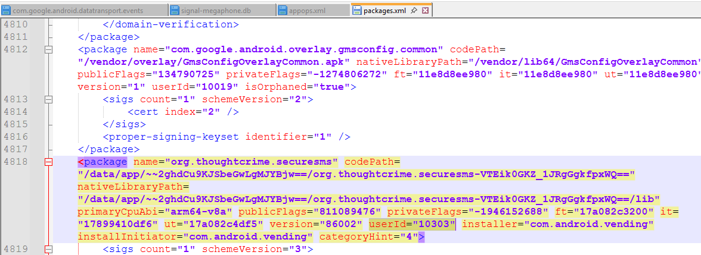

Grepping for the entry "10303" in `data/system/appops.xml` reveals the points in time in which the Signal app was started or put into the foreground, the attribute values that start with "1626..." are UNIX timestamps:

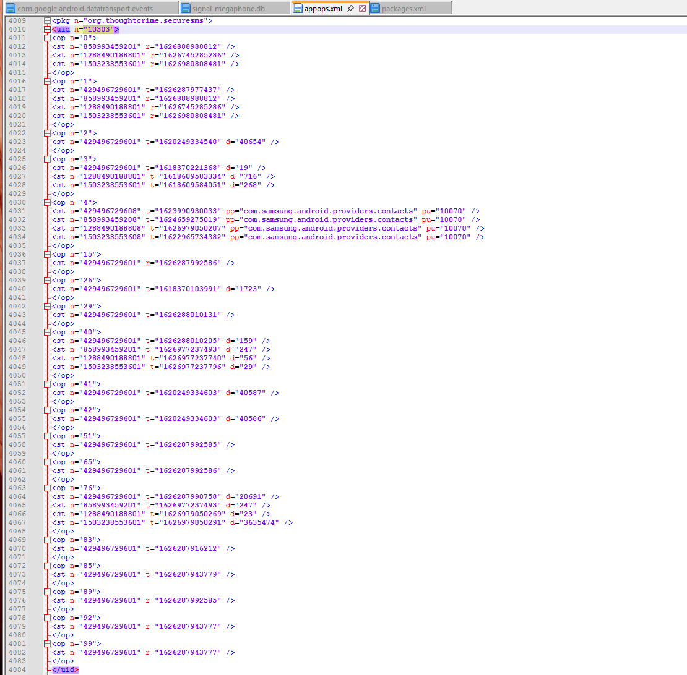

The `op` tags indicate specific operations, e.g. the operation for writing a message is `15`, see [Android Documentation](https://developer.android.com/reference/android/app/AppOpsManager):

```xml
<op n="15">
<st n="429496729601" r="1626287992586" />
</op>
```

The timestamps indicate that Heisenberg used the Signal App on the 14th of July between 6:39:48.033 PM and 6:40:10.205 PM Greenwich Mean Time. Assuming Heisenberg used the cell phone in Virginia, the local time would be 2:39 in the afternoon.


### Witness Report

>The smartphone’s owner, called Heisenberg, was arrested for allegedly dealing with stolen cars.  
>Your job: figure out if is that really the case?  

Provided that the video `data/media/0/DCIM/Camera/20210720_150222.mp4` is not counterfeit, Heisenberg was arrested for selling a stolen car on July 20th 2021.

>Are there clues or evidence for Heisenberg dealing with (stolen) cars? (2 points)

The evidence found on the cell phone, i.e. text conversations, photos of cars and related products, indicate that the owner did use the cell phone for selling used cars.

>Heisenberg used his cellphone during the arrest. Did he create any recordings of the arrest? Note: arrest took place on 2021-07-20 (1 point)

Yes, provided the video `data/media/0/DCIM/Camera/20210720_150222.mp4` is not fake, Heisenberg did record his own arrest.

>Are there any hints that the police did not quite follow best practices in handling the cellphone during/after the arrest? If so, what did they do wrong? (1 point)

The `data/system/packages.xml` indicates that the cell phone did send and receive network traffic after the arrest. This should not have happened had the police followed best practices by putting the cell phone in a Faraday bag.

>Are there any clues for Heisenberg taking an interest in cryptocurrency? (2 points)

Yes, Heisenberg received update emails from a Twitter/X Account `ItsDogeCoin`, indicating he was following that account.

>Did Heisenberg use any apps for file hiding or encryption? (1 point)

Yes, Heisenberg did install and use the `HideX` application.

>Are there any clues for Heisenberg connecting or planning to connect external drives to his Cellphone? (1 point)

Yes, Heisenberg did search for the terms "can a samsung micro usb connector transfer data" and "how to mount a pendrive on android" in the installed Chrome web browser.

>Was the image with the MD5 hash “066858f4b1971b0501b9a06296936a34” hidden by Heisenberg? If yes, what app was used? (1 point)

Yes, this image was hidden, as it could be found in the data folder associated with the `HideX` application: `data/data/com.flatfish.cal.privacy/cache/image_manager_disk_cache/7ae6e97ba4ad0d693413273d6e270a412af3331a9c96c7a9049e3ae9b6047c9d.0`.

>Where did Heisenberg plan to meet with the owner of the telephone number “+15402993169”? (1 point)  

He planned to meet the contact in Blacksburg VA, at Washington Street/Kent Street, aside the Washington Street Tennis Courts Center. 

>At which time(s) did Heisenberg actively use the Signal app on 2021-07-14? (2 points).

Heisenberg actively used the Signal app on 2021-07-14 at 2:39 in the afternoon (local time).
